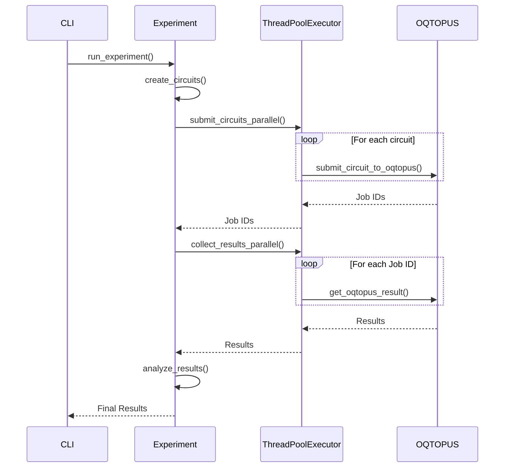

# QuantumLib

A modular quantum computing framework for research and experimentation.

## Installation

```bash
pip install git+https://github.com/orangekame3/quantumlib.git
```

## Quick Start

```bash
# CHSH Bell test
quantumlib-chsh run --devices qulacs --shots 1000 --points 20

# Rabi oscillations
quantumlib-rabi run --devices qulacs --shots 1000 --points 40 --backend oqtopus --parallel 20

# Other experiments
quantumlib-ramsey run --devices qulacs --shots 1000 --points 30
quantumlib-t1 run --devices qulacs --shots 2000 --points 25 --backend oqtopus --parallel 8
quantumlib-t2-echo run --devices qulacs --shots 1000 --points 20 --backend oqtopus
```

## Usage

### Common Options

All commands support these options:

- `--devices`: Quantum devices to use (default: qulacs)
- `--shots`: Number of measurement shots (default: 1000)
- `--backend`: Experiment backend (default: local_simulator)
- `--parallel`: Number of parallel threads (default: 4)
- `--no-save`: Skip saving data
- `--no-plot`: Skip generating plots
- `--show-plot`: Display plots interactively
- `--verbose`: Verbose output

### CHSH Bell Inequality Test

```bash
# Basic usage
quantumlib-chsh run --devices qulacs --shots 1000 --points 20

# High-resolution scan with parallel execution
quantumlib-chsh run --devices qulacs --shots 5000 --points 50 --backend oqtopus --parallel 10
```

Options:
- `--points`: Number of phase points to scan (default: 20)

### Rabi Oscillation Experiment

```bash
# Basic usage
quantumlib-rabi run --devices qulacs --shots 1000 --points 20 --max-amplitude 6.28

# High-resolution scan with more parallel workers
quantumlib-rabi run --devices qulacs --shots 1000 --points 40 --backend oqtopus --parallel 20
```

Options:
- `--points`: Number of amplitude points (default: 20)
- `--max-amplitude`: Maximum drive amplitude in radians (default: 2π)

### Other Experiments

```bash
# Ramsey interference
quantumlib-ramsey run --devices qulacs --shots 1000 --points 30

# T1 relaxation time measurement
quantumlib-t1 run --devices qulacs --shots 2000 --points 25 --backend oqtopus --parallel 8

# T2 coherence time with echo
quantumlib-t2-echo run --devices qulacs --shots 1000 --points 20 --backend oqtopus
```

### Help

Get detailed help for any command:

```bash
quantumlib-chsh --help
quantumlib-rabi --help
```

## Library Usage

You can also use QuantumLib directly in Python code:

### Basic Example

```python
from quantumlib.experiments.chsh.chsh_experiment import CHSHExperiment
from quantumlib.experiments.rabi.rabi_experiment import RabiExperiment

# CHSH Bell inequality test
chsh = CHSHExperiment()
results = chsh.run_experiment(
    devices=['qulacs'],
    shots=1000,
    phase_points=20
)

# Rabi oscillation experiment
rabi = RabiExperiment()
results = rabi.run_experiment(
    devices=['qulacs'],
    shots=1000,
    amplitude_points=20,
    max_amplitude=6.28
)
```

### Circuit Generation

```python
from quantumlib.circuit.chsh_circuits import create_chsh_circuit
from quantumlib.circuit.rabi_circuits import create_rabi_circuit

# Generate CHSH circuit
circuit = create_chsh_circuit(theta_a=0, theta_b=0.785, phi=1.57)

# Generate Rabi circuit
circuit = create_rabi_circuit(amplitude=3.14)
```

### Custom Experiments

```python
from quantumlib.core.base_experiment import BaseExperiment

class MyExperiment(BaseExperiment):
    def create_circuits(self, **params):
        # Your circuit generation logic
        return circuits

    def analyze_results(self, results):
        # Your analysis logic
        return analysis_data

# Run your custom experiment
experiment = MyExperiment()
results = experiment.run_experiment(devices=['qulacs'])
```

## Architecture

This project features a parallel job submission and aggregation function, the architecture of which is described below.

```mermaid
graph TD
    A[CLI Interface Typer] --> B{Experiment Type};
    B --> C[Experiment Class];
    C --> D[Circuit Generation];
    D --> E{Execution Backend};
    E --> F[Local Simulator];
    E --> G[OQTOPUS Backend];
    F --> H[Parallel Execution (ThreadPoolExecutor)];
    G --> H;
    H --> I[Job Submission];
    I --> J[OQTOPUS];
    J --> K[Result Aggregation];
    K --> L[Analysis & Visualization];
```

1. **CLI Interface (`base_cli.py`)**:
    - The command-line interface is built using `Typer`.
    - The `run` command serves as the entry point for executing experiments.
    - The `run_parallel_execution` method manages parallel execution by selecting either the `oqtopus` or `local_simulator` backend.
    - `Rich` is used to display progress bars and formatted output.

2. **Experiment (`base_experiment.py`)**:
   - This is the base class for individual experiments (e.g., CHSH, T1).
   - The `submit_circuits_parallel` method uses `ThreadPoolExecutor` to submit multiple circuits to OQTOPUS in parallel.
   - The `collect_results_parallel` method collects the results of the submitted jobs in parallel.
   - Local simulation is also supported via the `run_circuit_locally` method.

3. **Backend (`oqtopus.py`)**:
   - This module handles communication with the OQTOPUS backend using `quri-parts-oqtopus`.
   - `submit_circuit_to_oqtopus` submits a single circuit.
   - `get_oqtopus_result` retrieves the result of a job.

### Parallel Execution Flow

The following diagram illustrates the process of parallel job submission and result aggregation.



## Features

- CHSH Bell inequality experiments
- Rabi oscillation measurements
- Ramsey interference experiments
- T1/T2 coherence time measurements
- Multiple backend support (Qulacs, OQTOPUS)
- Parallel execution and data visualization

## Development

### Setup

```bash
git clone https://github.com/orangekame3/quantumlib.git
cd quantumlib
uv sync
uv pip install -e .
```

### Development Commands

```bash
# Run experiments using workspace scripts
uv run workspace/scripts/chsh.py run --devices qulacs --shots 1000 --points 20
uv run workspace/scripts/rabi.py run --devices qulacs --shots 1000 --points 40 --backend oqtopus --parallel 20
uv run workspace/scripts/ramsey.py run --devices qulacs --shots 1000 --points 30
uv run workspace/scripts/t1.py run --devices qulacs --shots 2000 --points 25 --backend oqtopus --parallel 8
uv run workspace/scripts/t2_echo.py run --devices qulacs --shots 1000 --points 20

# Code quality checks
uv run ruff check src/
uv run black src/
uv run mypy src/

# Run tests
uv run pytest
uv run pytest tests/test_chsh.py  # specific test
uv run pytest -v                  # verbose output

# Build package
uv build
```

### Project Structure

```
quantumlib/
├── src/quantumlib/          # Main library code
│   ├── cli/                 # CLI framework
│   ├── experiments/         # Experiment implementations
│   ├── circuit/             # Circuit factories
│   ├── backend/             # Device backends
│   └── core/                # Base classes
├── workspace/               # Development workspace
│   ├── scripts/             # CLI scripts for development
│   ├── configs/             # Configuration files
│   └── experiments/         # Experiment results
└── tests/                   # Test suite
```

## Requirements

- Python 3.12+
- Quantum simulators: Qulacs, Qiskit, Cirq
- Scientific computing: NumPy, SciPy, Matplotlib

## License

MIT License
