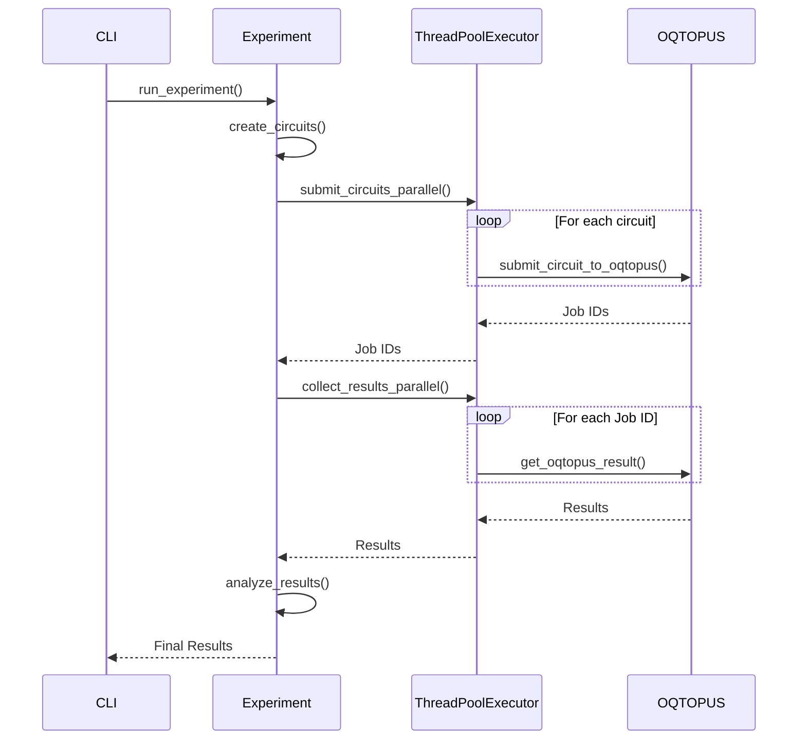

# OQTOPUS Experiments

A modular quantum computing experiment library for the OQTOPUS platform.

## Installation

```bash
pip install git+https://github.com/orangekame3/oqtopus-experiments.git
```

## Quick Start

```bash
# CHSH Bell test
oqtopus-chsh run --devices qulacs --shots 1000 --points 20

# Rabi oscillations
oqtopus-rabi run --devices qulacs --shots 1000 --points 40 --backend oqtopus --parallel 20

# Other experiments
oqtopus-ramsey run --devices qulacs --shots 1000 --points 30
oqtopus-t1 run --devices qulacs --shots 2000 --points 25 --backend oqtopus --parallel 8
oqtopus-t2-echo run --devices qulacs --shots 1000 --points 20 --backend oqtopus
```

## Usage

### Common Options

All commands support these options:

- `--devices`: Quantum devices to use (default: qulacs)
- `--shots`: Number of measurement shots (default: 1000)
- `--backend`: Experiment backend (default: local_simulator)
- `--parallel`: Number of parallel threads (default: 4)
- `--no-save`: Skip saving data
- `--no-plot`: Skip generating plots
- `--show-plot`: Display plots interactively
- `--verbose`: Verbose output

### CHSH Bell Inequality Test

```bash
# Basic usage
oqtopus-chsh run --devices qulacs --shots 1000 --points 20

# High-resolution scan with parallel execution
oqtopus-chsh run --devices qulacs --shots 5000 --points 50 --backend oqtopus --parallel 10
```

Options:

- `--points`: Number of phase points to scan (default: 20)

### Rabi Oscillation Experiment

```bash
# Basic usage
oqtopus-rabi run --devices qulacs --shots 1000 --points 20 --max-amplitude 6.28

# High-resolution scan with more parallel workers
oqtopus-rabi run --devices qulacs --shots 1000 --points 40 --backend oqtopus --parallel 20
```

Options:

- `--points`: Number of amplitude points (default: 20)
- `--max-amplitude`: Maximum drive amplitude in radians (default: 2π)

### Parity Oscillation Experiment (GHZ Decoherence)

Study the decoherence of GHZ states through parity oscillation measurements, based on [Ozaeta & McMahon (2019)](https://doi.org/10.1088/2058-9565/ab13e5).

```bash
# Basic usage - test 1-4 qubit GHZ states
oqtopus-parity-oscillation run --num-qubits 1 2 3 4 --delays 0 1 2 4 --shots 1000

# High-resolution decoherence study
oqtopus-parity-oscillation run --num-qubits 1 2 3 4 5 --delays 0 1 2 4 8 16 --shots 2000 --show-plot

# Quick test with custom phase points
oqtopus-parity-oscillation run --num-qubits 2 3 --delays 0 2 --phase-points 9 --shots 512
```

Options:

- `--num-qubits`: List of qubit counts to test (default: [1,2,3,4,5])
- `--delays`: List of delay times in microseconds (default: [0,1,2,4,8,16])
- `--phase-points`: Number of phase points (default: 4N+1 for each N)

### Other Experiments

```bash
# Ramsey interference
oqtopus-ramsey run --devices qulacs --shots 1000 --points 30

# T1 relaxation time measurement
oqtopus-t1 run --devices qulacs --shots 2000 --points 25 --backend oqtopus --parallel 8

# T2 coherence time with echo
oqtopus-t2-echo run --devices qulacs --shots 1000 --points 20 --backend oqtopus
```

### Help

Get detailed help for any command:

```bash
oqtopus-chsh --help
oqtopus-rabi --help
oqtopus-parity-oscillation --help
```

## Library Usage

You can also use OQTOPUS Experiments directly in Python code:

### Basic Example

```python
from oqtopus_experiments.experiments.chsh import CHSHExperiment
from oqtopus_experiments.experiments.rabi import RabiExperiment
from oqtopus_experiments.experiments.parity_oscillation import ParityOscillationExperiment

# CHSH Bell inequality test
chsh = CHSHExperiment()
results = chsh.run_experiment(
    devices=['qulacs'],
    shots=1000,
    phase_points=20
)

# Rabi oscillation experiment
rabi = RabiExperiment()
results = rabi.run_experiment(
    devices=['qulacs'],
    shots=1000,
    amplitude_points=20,
    max_amplitude=6.28
)

# Parity oscillation (GHZ decoherence) experiment
parity = ParityOscillationExperiment()
results = parity.run_experiment(
    devices=['qulacs'],
    shots=1000,
    num_qubits_list=[1, 2, 3, 4],
    delays_us=[0, 1, 2, 4, 8],
    phase_points=21
)
```

### Circuit Generation

#### Modern Classmethod-Based Circuit Creation (Recommended)

The new functional programming approach provides type-safe, stateless circuit creation with comprehensive metadata:

```python
from oqtopus_experiments.experiments.t1 import T1Experiment
from oqtopus_experiments.experiments.ramsey import RamseyExperiment
from oqtopus_experiments.experiments.chsh import CHSHExperiment
from oqtopus_experiments.experiments.rabi import RabiExperiment
from oqtopus_experiments.experiments.t2_echo import T2EchoExperiment

# T1 relaxation time circuits
circuits, metadata = T1Experiment.create_t1_circuits(
    delay_points=20,
    max_delay=50000.0,  # 50 μs
    basis_gates=["sx", "x", "rz", "cx"]
)

# Ramsey interference circuits with detuning
circuits, metadata = RamseyExperiment.create_ramsey_circuits(
    delay_points=25,
    max_delay=10000.0,  # 10 μs
    detuning=1.5  # MHz
)

# CHSH Bell inequality test circuits
circuits, metadata = CHSHExperiment.create_chsh_circuits(
    phase_points=20,
    theta_a=0.0,
    theta_b=3.14159/4
)

# Rabi oscillation circuits
circuits, metadata = RabiExperiment.create_rabi_circuits(
    amplitude_points=30,
    max_amplitude=2*3.14159,
    drive_time=1.0,
    drive_frequency=0.5
)

# T2 Echo circuits (Hahn Echo or CPMG)
circuits, metadata = T2EchoExperiment.create_t2_echo_circuits(
    delay_points=25,
    max_delay=100000.0,  # 100 μs
    echo_type="hahn",  # or "cpmg"
    num_echoes=1
)

# Access rich metadata
print(f"Created {len(circuits)} circuits")
print(f"Experiment type: {metadata['experiment_type']}")
print(f"Parameters: {metadata}")
```

#### Functional Composition and Parameter Exploration

```python
# Combine circuits from different experiments for batch execution
t1_circuits, t1_meta = T1Experiment.create_t1_circuits(delay_points=10)
ramsey_circuits, ramsey_meta = RamseyExperiment.create_ramsey_circuits(delay_points=10)

all_circuits = t1_circuits + ramsey_circuits
all_metadata = [t1_meta, ramsey_meta]

# Parameter exploration
results = {}
for delay_points in [10, 20, 50]:
    for max_delay in [1000, 5000, 10000]:
        circuits, metadata = T1Experiment.create_t1_circuits(
            delay_points=delay_points,
            max_delay=max_delay
        )
        key = f"points_{delay_points}_delay_{max_delay}"
        results[key] = {
            "circuit_count": len(circuits),
            "delay_range": (metadata['delay_times'][0], metadata['delay_times'][-1])
        }
```

#### Legacy Circuit Factories (Still Supported)

```python
from quantumlib.circuit.chsh_circuits import create_chsh_circuit
from quantumlib.circuit.rabi_circuits import create_rabi_circuit
from quantumlib.circuit.parity_circuits import create_ghz_with_delay_rotation

# Generate CHSH circuit
circuit = create_chsh_circuit(theta_a=0, theta_b=0.785, phi=1.57)

# Generate Rabi circuit
circuit = create_rabi_circuit(amplitude=3.14)

# Generate GHZ circuit with delay and parity rotation
circuit = create_ghz_with_delay_rotation(num_qubits=3, delay_us=2.0, phi=1.57)
```

### Custom Experiments

```python
from quantumlib.core.base_experiment import BaseExperiment

class MyExperiment(BaseExperiment):
    def create_circuits(self, **params):
        # Your circuit generation logic
        return circuits

    def analyze_results(self, results):
        # Your analysis logic
        return analysis_data

# Run your custom experiment
experiment = MyExperiment()
results = experiment.run_experiment(devices=['qulacs'])
```

## Architecture

This project features a parallel job submission and aggregation function, the architecture of which is described below.

1. **CLI Interface (`base_cli.py`)**:
    - The command-line interface is built using `Typer`.
    - The `run` command serves as the entry point for executing experiments.
    - The `run_parallel_execution` method manages parallel execution by selecting either the `oqtopus` or `local_simulator` backend.
    - `Rich` is used to display progress bars and formatted output.

2. **Experiment (`base_experiment.py`)**:
   - This is the base class for individual experiments (e.g., CHSH, T1).
   - The `submit_circuits_parallel` method uses `ThreadPoolExecutor` to submit multiple circuits to OQTOPUS in parallel.
   - The `collect_results_parallel` method collects the results of the submitted jobs in parallel.
   - Local simulation is also supported via the `run_circuit_locally` method.

3. **Backend (`oqtopus.py`)**:
   - This module handles communication with the OQTOPUS backend using `quri-parts-oqtopus`.
   - `submit_circuit_to_oqtopus` submits a single circuit.
   - `get_oqtopus_result` retrieves the result of a job.

### Parallel Execution Flow

The following diagram illustrates the process of parallel job submission and result aggregation.



## Features

### Quantum Experiments
- CHSH Bell inequality experiments
- Rabi oscillation measurements
- Parity oscillation experiments (GHZ decoherence studies)
- Ramsey interference experiments
- T1/T2 coherence time measurements

### Modern Architecture
- **Functional Programming Patterns**: Stateless circuit creation with classmethods
- **Type Safety**: Comprehensive type annotations with mypy support
- **Enhanced Testability**: Direct circuit generation without experiment instances
- **Backward Compatibility**: Existing APIs continue to work unchanged
- **Rich Metadata**: Comprehensive experiment parameters and circuit information

### Execution & Backends
- Multiple backend support (Qulacs, OQTOPUS)
- Parallel execution and data visualization
- Efficient parameter exploration and batch processing

## Development

### Setup

```bash
git clone https://github.com/orangekame3/quantumlib.git
cd quantumlib
uv sync
uv pip install -e .
```

### Development Commands

```bash
# Run experiments using workspace scripts
uv run workspace/scripts/chsh.py run --devices qulacs --shots 1000 --points 20
uv run workspace/scripts/rabi.py run --devices qulacs --shots 1000 --points 40 --backend oqtopus --parallel 20
uv run workspace/scripts/parity_oscillation_cli.py run --num-qubits 1 2 3 4 --delays 0 1 2 4 --shots 1000
uv run workspace/scripts/ramsey.py run --devices qulacs --shots 1000 --points 30
uv run workspace/scripts/t1.py run --devices qulacs --shots 2000 --points 25 --backend oqtopus --parallel 8
uv run workspace/scripts/t2_echo.py run --devices qulacs --shots 1000 --points 20

# Code quality checks
uv run ruff check src/
uv run black src/
uv run mypy src/

# Run tests
uv run pytest
uv run pytest tests/test_chsh.py  # specific test
uv run pytest -v                  # verbose output

# Build package
uv build
```

### Project Structure

```shell
quantumlib/
├── src/quantumlib/          # Main library code
│   ├── cli/                 # CLI framework
│   ├── experiments/         # Experiment implementations
│   ├── circuit/             # Circuit factories
│   ├── backend/             # Device backends
│   └── core/                # Base classes
├── workspace/               # Development workspace
│   ├── scripts/             # CLI scripts for development
│   ├── configs/             # Configuration files
│   └── experiments/         # Experiment results
└── tests/                   # Test suite
```

## Requirements

- Python 3.12+
- Quantum simulators: Qulacs, Qiskit, Cirq
- Scientific computing: NumPy, SciPy, Matplotlib

## License

MIT License
